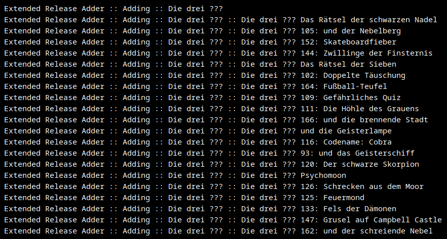

## ExtendedReleaseAdder

 

  

  <h3 align="center">ExtendedReleaseAdder</h3>

  

    Addes Musicbrainz Releases, which Lidarr isn't able to add by itself!
     
    <a href="https://github.com/Makario1337/ExtendedReleaseAdder/issues">Report Bug</a>
    ·
    <a href="https://github.com/Makario1337/ExtendedReleaseAdder/issues">Request Feature</a>
  

## Usage
Copy the script into your config folder and run it with (in the container- docker exec -it containername bash) bash ./ERA.sh. Keep in mind that the artists.json needs to be in the same place.
You can add more artist by copying the Musicbrainz Artist ID into the array like this:

{  
  "artits": ["RandomMusicBrainzArtistString1", "RandomMusicBrainzArtistString2"]  
}  

IMPORTANT: 
Files will be placed in the library /audiobooks. Please adjust your docker config according to that. Otherwise the script won't run.
It is possible to have two seperate root folders (one for music e.g /music and one for those special releases /audiobooks.

This Script was only tested with [Lidarr-Extended](https://github.com/RandomNinjaAtk/docker-lidarr-extended), Lidarr may work but could have some missing dependencies.

Ps: This script is also implemented in [Lidarr-Extended](https://github.com/RandomNinjaAtk/docker-lidarr-extended) and can be activated with the parameter lidarrAudiobookRootFolder=/customaudiobookpath

<!-- ACKNOWLEDGMENTS -->
## ACKNOWLEDGMENTS
* [Lidarr-Extended](https://github.com/RandomNinjaAtk/docker-lidarr-extended)
* [Lidarr](https://github.com/Lidarr/Lidarr)

